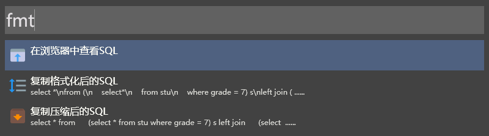

## Wox.Plugin.Formatter

格式化剪切板内容，支持JSON、XML、SQL以及多种常用格式化方式。

## 格式化

### JSON

当剪切板内容为JSON格式数据时，会识别内容并提供相应的选项：  


"在浏览器查看"会使用默认浏览器打开一个内置的HTML文件，并处理剪切板中的JSON文本：


### XML

与JSON类似，当剪切板内容为XML格式数据时，会提供相应的选项：  


同时也提供了一个查看结构的页面：


### SQL

与JSON类似，当剪切板内容为SQL格式数据时，会提供相应的选项：  


提供了一个查看具有代码高亮的页面：


### 其它

当剪切板内容不符合上面的格式时，会提供其它可选的操作，即使符合上面的格式，也可以键入相应的命令来选择这些操作。


1. `rmn`：删除换行，使多行文本变成一行，每行之间添中一个空格。
2. `adq`：添加引号，例如
    ```sql
    select * from 
        (select * from stu where grade = 7) s
    left join 
        (select * from sco where subject = "math") t
    on s.id = t.stu_id;
    ```
    添加引号后会变成
    ```java
    "select * from \n"+
    "    (select * from stu where grade = 7) s\n"+
    "left join \n"+
    "    (select * from sco where subject = "math") t\n"+
    "on s.id = t.stu_id;"
    ```
3. `view`：查看剪切板内容
    + 在JSON视图中查看
    + 在XML视图中查看
    + 在代码视图中查看
    + 鼠标悬浮直接查看

## 安装

下载[压缩包](https://github.com/enria/Wox.Plugin.Formatter/releases)，解压放到Wox的插件目录，重启Wox。
